# Procédure de Déploiement

Décrivez ci-dessous votre procédure de déploiement en détaillant chacune des étapes. De la préparation du VPS à la méthodologie de déploiement continu.

## Préparation du VPS

### 1. Connexion SSH

    Se connecter au ssh via le terminal  en local.

    Ligne de commande : ssh root@[IP_DU_SERVEUR]

### 2. Installer aaPanel

    Une fois connecter sur le VPS, installer aa Panel, qui permettra d’installer toutes les dépendances nécessaire.

    Ligne de commande : URL=https://www.aapanel.com/script/install_7.0_en.sh && if [ -f /usr/bin/curl ];then curl -ksSO "$URL" ;else wget --no-check-certificate -O install_7.0_en.sh "$URL";fi;bash install_7.0_en.sh aapanel

    Une fois installer, bien garder les informations fournis, l'adresse ainsi que les identifiants :

    - aaPanel Internal Address:[https://172.17.4.11:11212/017757a6](https://172.17.4.11:11212/017757a6),

    - username : worbeivh

    - password : 52ae12df

Il faut donc ensuite se connecter : 

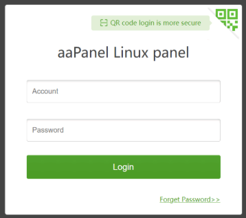

Une fois connecter il faudra chosiir une façon d'installer l'environnement : 

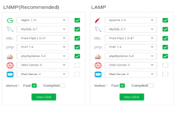

Il faut choisir LNMP et la l'insallation de l'environnement commence.

Une fois installer, on va créer le website, pour que cela soit deja configurer, avec donc l'ip sur VPS :

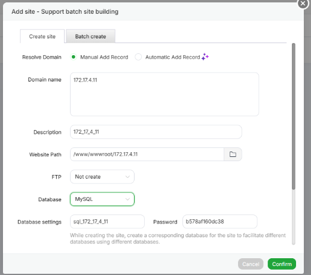

J'ai décider de créer la base de donnée a la création du site, il faut donc la aussi bien récupérer les identifants de la base de données.

Ensuite nous obtenons cette ligne : 

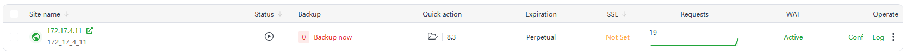

### 3. Configuration

Je vais confifgurer le vps pour qu’il accueil le projet, pour se faire, il faut aller à la racine puis dans le dossier /var pour créer le dossier d'accueil du dépot git.

    Voici les lignes de commande :

    cd /

    cd var

    mkdir depot_git

Ensuite je vais à l'interieur du dossier que je viens de créer :

    Voici la ligne de commande : cd depot_git

Suite à cela j'initlise git dans ce dossier :

    Voici la ligne de commande : git init --bare

Maitenant, on va ajouter le remote a ce dossier !RETOURNER DANS LE TERMINAL DU PROJET EN LOCALE! :

    Voici la ligne de commande : git remote add [NOM_DU_REMOTE] root@[IP_DU_SERVEUR]:/var/depot_git

Cela me permet de pouvoir pousser le code de mon local, jusqu'au dossier depot_git sur le VPS.

En suite je créer un fichier deploy.sh, qui va me permettre de mettre a jour la branch en lançant le fichier avec le tag en paramètre dans la ligne de commande.

Contenu du fichier deploy.sh:

git --work-tree=/www/wwwroot/IP_DU_SERVEUR --git-dir=/var/depot_git checkout -f $1

Une fois que le projet est deployer, il faut définir la bonne racine du projet, qui est le dossier public : 

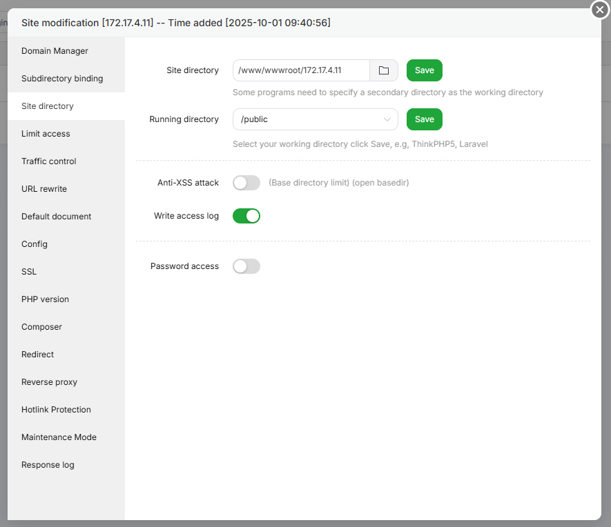

Après, il faut lancer l'installation des dépandances, je le fait via l'interface aaPanel, cela me permet de faire : composer install.

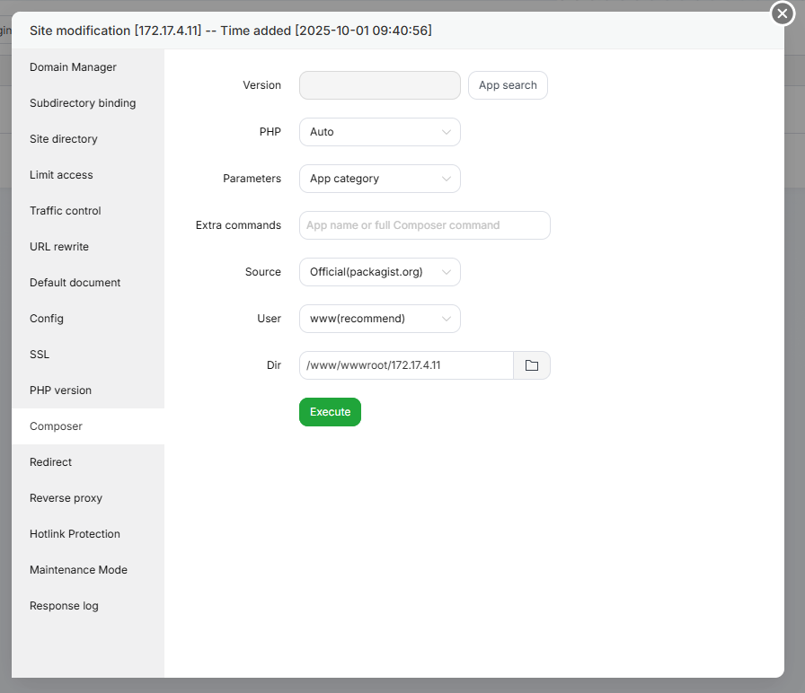

Ensuite il faut aussi aller dans les paramètres de redirection et définir le modèle mvc : 

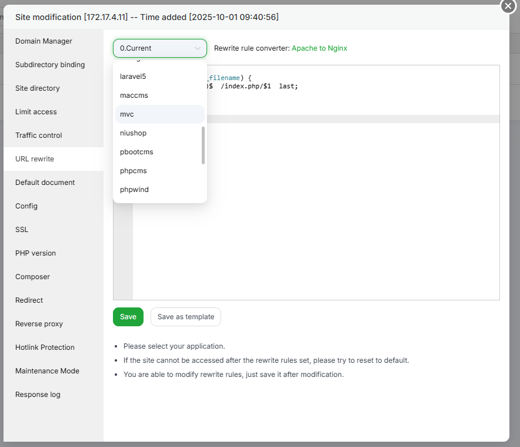

Maintenant, le projet est déployer et les redirection fonctionnent : 

HOME PAGE

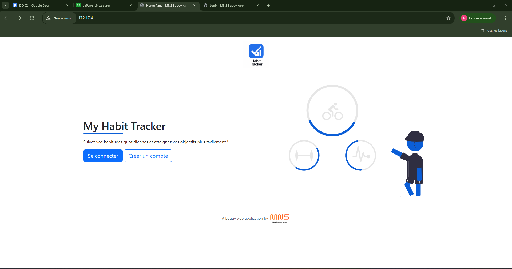

LOGIN PAGE

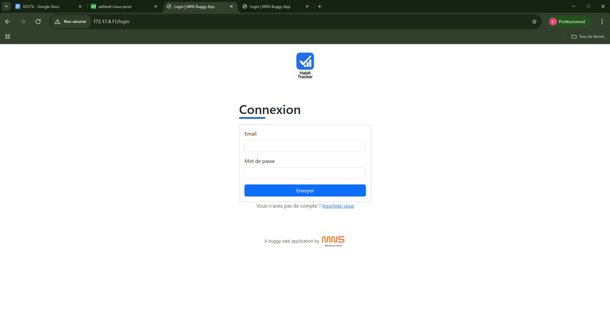

Pour intégrer la base de donnée, je me suis rendu dans le phpmyadmin de aaPanel.

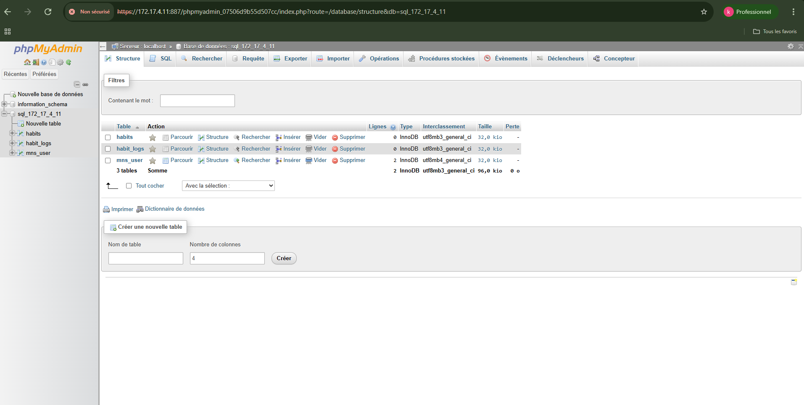

Et j'ai directement intégrer le script SQL afin d'insérer les données.

J'ai ensuite établi la connexion avec la bdd en insérer les bonnes valeurs dans le fichier .env.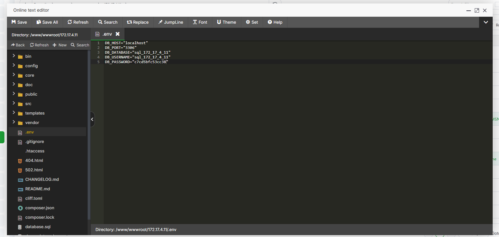

La connexion fonctionne maintenant.

## Méthode de déploiement

### 1. Récupérer le repository

Première chose a faire c'est récupérer le repo distant sur mon local.

    Voici la ligne de commande : git clone [URL_REPO_DISTANT]

### 2. Installer les dépendances

Une fois récupérer, aller à la racine du projet et installer les dépendances en local.

    Voici la ligne de commande : cd [NOM_DU_FICHIER_PROJET]

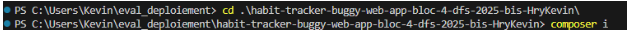

Ensuite il faut initialiser git cliff, qui servira à générer le fichier CHANGELOG.md

    Voici la ligne de commande : git cliff --init

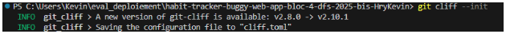

Après cela je fait une première génération de changelog :

    Voici la ligne de commande : git cliff –bump -o .\CHANGELOG.md

Ensuite je fait un commit.

    Voici la ligne de commande : git commit -a -m "Initialisation"

J'attribut un tag : 

    Voici la ligne de commande : git tag 0.1.0

Et je pousse les changement vers github : 

    Voici la ligne de commande : git push origin main --tags

Je déploie vers le dossier depot_git qui est sur le VPS : 

    Voici la ligne de commande : git push [NOM_DU_REMOTE] 0.1.0

Pour finir, je vais a la racine de mon VPS, et je lance de fichier deploy.sh avec comme  argument le tag.

    Voici la ligne de commande : bash deploy.sh 0.0.1

Maintenant le site est en ligne et a jour avec la branche main.
