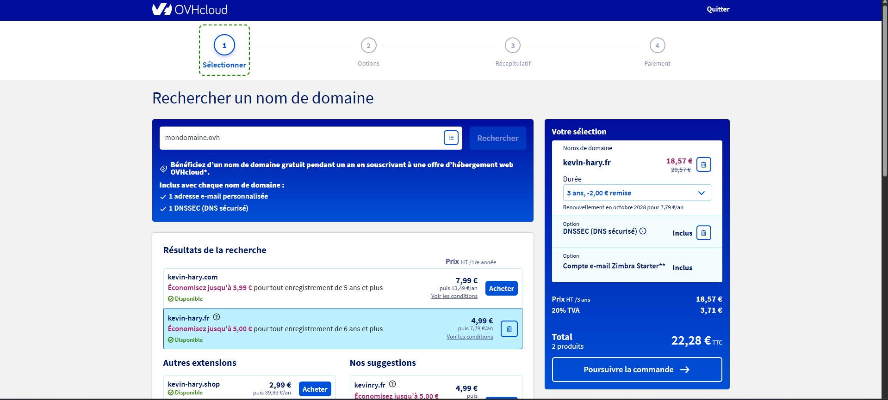
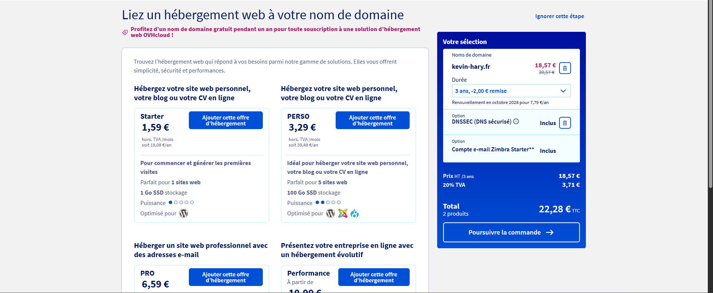
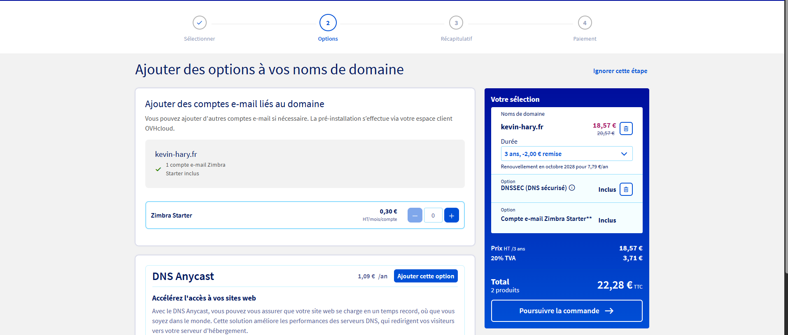

# Questions

Répondez ici aux questions théoriques en détaillant un maxium vos réponses :

1) Expliquer la procédure pour réserver un nom de domaine chez OVH avec des captures d'écran (arrêtez-vous au paiement) :

   Il faut se rendre sur le site ovhcloud.com, dans la section nom de domaine et rechercher le nom de domaine que l'on souhaite :

Ensuite OVH nous propose de directement lié un hebergement au nom de domaine. 

Cela nous propose aussi différentes options concernant le nom de domaine. Comme ajouter des emails.

Ensuite viens le paiement.

2. Comment faire pour qu'un nom de domaine pointe vers une adresse IP spécifique ?

La manière de lier un nom de domaine et un serveur est toujours la même, quel que soit le duo de registraire et d’hébergeur VPS. Il s’agira de paramétrer les DNS c’est-à-dire les enregistrement système de noms de domaine. Si vous enregistrez un nom de domaine auprès de votre hébergeur, aucune action n’est requise : le nom de domaine pointera automatiquement sur votre compte d’hébergement.

Dans le cas de deux prestataires distincts, vous devrez paramétrer les DNS pour faire pointer votre nom de domaine vers votre serveur. Pour cela, rendez-vous sur l’interface de votre hébergeur, dans la gestion des paramètres des noms de domaine. Éditez un enregistrement pour votre nom de domaine avec et sans www., et faites-les pointer vers l’IP de votre serveur.

Vous y trouverez un onglet « redirection », puis une option « ajouter une redirection ». Vous choisissez le sous-domaine concerné, et sélectionnez une redirection vers une URL (adresse web complète), un domaine (canonical name) ou une adresse IP. Vous aurez alors le choix d’effectuer une redirection visible par le visiteur, ou invisible :

* Dans le premier cas, l’usager verra l’URL de destination.
* Dans le second cas, il verra le nom du sous-domaine.

La première option est généralement la plus pertinente.

Enfin, un code http déterminera pour les moteurs de recherche si la redirection est temporaire ou permanente. Si elle est temporaire, il s’agit d’une redirection 302. Si elle est permanente, il s’agit d’une redirection 301. Lorsque vous tapez l’URL cible, privilégiez la version https.

5. Comment mettre en place un certificat SSL ?

   En règle général, cela se passe dans l'interface de l'hébergeur, il met a disposition une section qui permet l'intégration du certificat SSL, selon l'offre un certificat gratuit ou payant vous est attribuer. Il est placer a la racine du projet, et fait office de certification pour les naviateurs.
